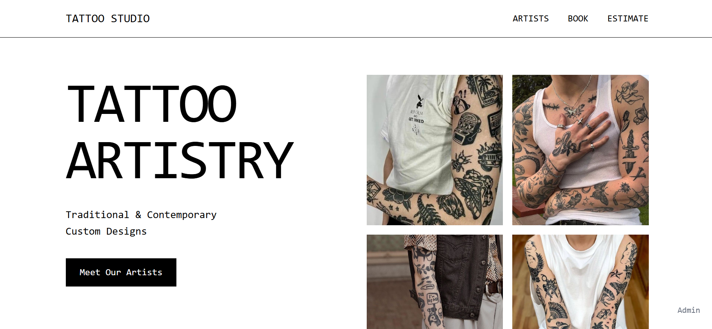
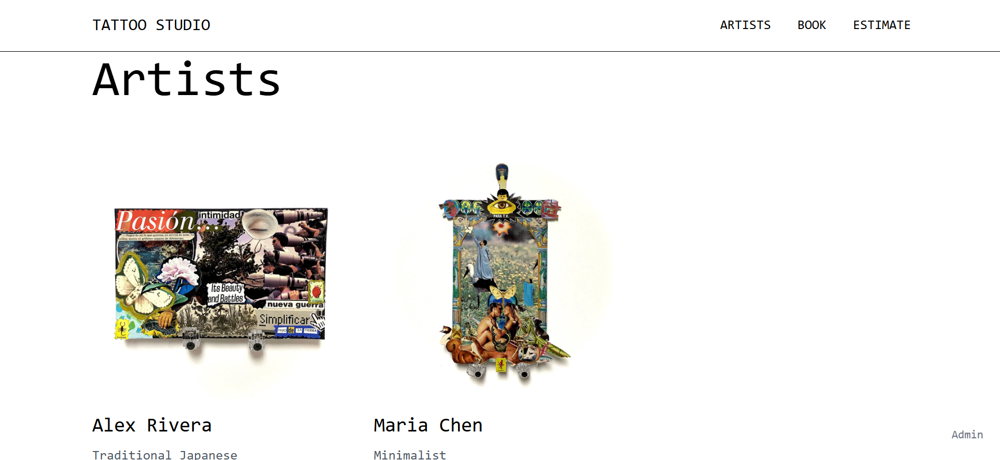
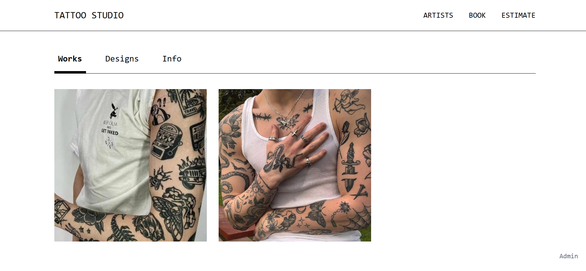
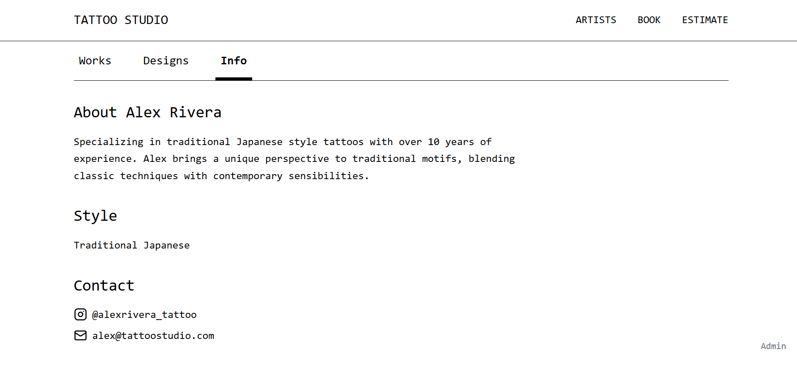
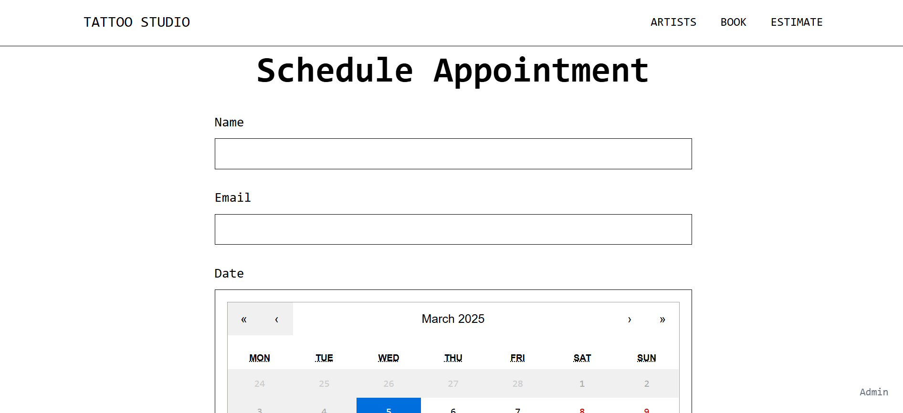

# 🎨 Tattoo Artistry Portfolio Website

## 🚀 Project Overview

A meticulously crafted React-powered website for a modern tattoo studio, showcasing artistic prowess, artist portfolios, and seamless booking experience.

## 📸 Screenshots

### Home Page - Tattoo Artistry Showcase

### Artists Gallery

### Artists works

### About Artists 

### Appointment Booking System

### Price Estimation Feature

## 🛠 Tech Stack

## ✨ Key Features

- 🖼️ Dynamic Portfolio Showcase
- 👩‍🎨 Artist Profiles with Unique Styles
- 📅 Interactive Appointment Scheduling
- 💰 Intelligent Price Estimation System

### 💡 Price Estimation Logic

The custom price estimation feature calculates tattoo costs based on:
- Tattoo Size
- Design Complexity
- Number of Colors
- Body Placement
